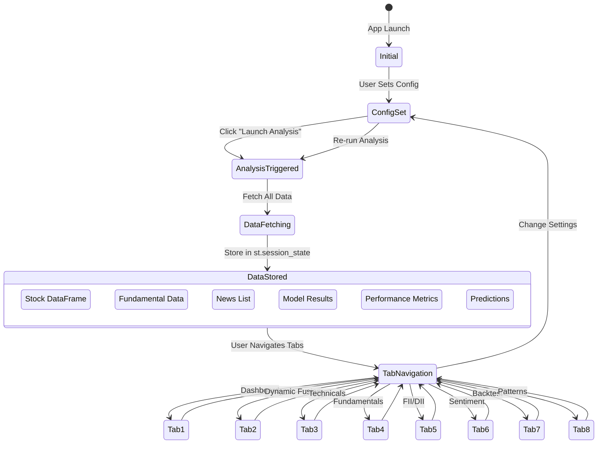

# ProTrader AI - System Flow Documentation

This document provides comprehensive mermaid diagrams for the entire ProTrader AI system flow.

---

## 1. High-Level System Architecture

```mermaid
flowchart TB
    subgraph Input["📥 Data Inputs"]
        UI["Streamlit UI"]
        Config["User Configuration"]
    end
    
    subgraph DataLayer["📊 Data Layer"]
        YF["Yahoo Finance API"]
        NSE["NSE India API"]
        News["NewsAPI"]
        RSS["RSS Feeds"]
        Reddit["Reddit API"]
        Trends["Google Trends"]
    end
    
    subgraph Processing["⚙️ Processing Layer"]
        StockData["Stock Data Fetcher"]
        FII_DII["FII/DII Fetcher"]
        VIX["VIX Data Fetcher"]
        Sentiment["Multi-Source Sentiment"]
        TechInd["Technical Indicators"]
    end
    
    subgraph Models["🤖 ML Models"]
        Hybrid["Hybrid Model<br/>(XGBoost + GRU)"]
        Fusion["Dynamic Fusion<br/>Framework"]
        Pattern["Pattern Analyst"]
    end
    
    subgraph Output["📈 Output Layer"]
        Charts["Plotly Charts"]
        Metrics["Performance Metrics"]
        AI["Gemini AI Analysis"]
        Backtest["Backtester"]
    end
    
    UI --> Config
    Config --> StockData
    Config --> FII_DII
    Config --> VIX
    Config --> Sentiment
    
    YF --> StockData
    YF --> VIX
    NSE --> FII_DII
    News --> Sentiment
    RSS --> Sentiment
    Reddit --> Sentiment
    Trends --> Sentiment
    
    StockData --> TechInd
    TechInd --> Hybrid
    TechInd --> Fusion
    TechInd --> Pattern
    
    FII_DII --> Hybrid
    VIX --> Hybrid
    Sentiment --> Hybrid
    
    FII_DII --> Fusion
    VIX --> Fusion
    Sentiment --> Fusion
    
    Hybrid --> Charts
    Hybrid --> Metrics
    Hybrid --> AI
    Hybrid --> Backtest
    
    Fusion --> Charts
    Pattern --> Charts
```

---

## 2. Complete Application Flow

```mermaid
flowchart TD
    Start(["🚀 User Launches App"]) --> Config["Configure Settings<br/>Stock, Dates, Options"]
    Config --> LaunchBtn{"Click 'Launch Analysis'?"}
    
    LaunchBtn -->|No| Wait["Wait for User"]
    Wait --> LaunchBtn
    
    LaunchBtn -->|Yes| FetchData["Fetch All Data"]
    
    subgraph DataFetch["📥 Data Fetching (Parallel)"]
        FetchData --> Stock["get_stock_data()"]
        FetchData --> Fundamentals["get_fundamental_data()"]
        FetchData --> NewsData["get_news()"]
        FetchData --> FII["get_fii_dii_data()"]
        FetchData --> VIXData["get_india_vix_data()"]
    end
    
    Stock --> Validate{"Data Valid?"}
    Validate -->|No| Error["Show Error Message"]
    Error --> End1(["❌ End"])
    
    Validate -->|Yes| Process["Process & Store in Session"]
    Process --> Tabs["Display 8 Analysis Tabs"]
    
    subgraph TabDisplay["📊 Tab Content"]
        Tabs --> Tab1["Dashboard Tab"]
        Tabs --> Tab2["Dynamic Fusion Tab"]
        Tabs --> Tab3["Technicals & Risk Tab"]
        Tabs --> Tab4["Fundamentals Tab"]
        Tabs --> Tab5["FII/DII Tab"]
        Tabs --> Tab6["Sentiment Tab"]
        Tabs --> Tab7["Backtest Tab"]
        Tabs --> Tab8["Pattern Tab"]
    end
    
    Tab1 --> End2(["✅ Analysis Complete"])
```

---

## 3. Hybrid Model Training Pipeline

```mermaid
flowchart TD
    Input["Raw OHLCV Data"] --> FE["Feature Engineering"]
    
    subgraph FeatureEng["🔧 Feature Engineering"]
        FE --> LogRet["Log Returns"]
        FE --> Vol["Volatility (5D, 20D)"]
        FE --> RSI["RSI Normalized"]
        FE --> VolRatio["Volume Ratio"]
        FE --> MADiv["MA Divergence"]
    end
    
    subgraph ExternalData["📊 External Data Integration"]
        Sent["Sentiment Data"] --> SentFeat["Sentiment Features (3)"]
        FII_DII["FII/DII Data"] --> InstFeat["Institutional Features (4)"]
        VIX["VIX Data"] --> VIXFeat["VIX Features (2)"]
    end
    
    LogRet --> Merge["Merge All Features<br/>(14 Total)"]
    Vol --> Merge
    RSI --> Merge
    VolRatio --> Merge
    MADiv --> Merge
    SentFeat --> Merge
    InstFeat --> Merge
    VIXFeat --> Merge
    
    Merge --> Split["Time-Series Split<br/>(80% Train / 20% Test)"]
    
    subgraph Scaling["📏 Scaling"]
        Split --> TrainScale["Scale Training Data<br/>MinMaxScaler(-1, 1)"]
        Split --> TestScale["Transform Test Data"]
    end
    
    subgraph Training["🤖 Model Training"]
        TrainScale --> XGB["XGBoost Regressor<br/>200 trees, depth=5"]
        TrainScale --> SeqCreate["Create Sequences<br/>(lookback=5)"]
        SeqCreate --> GRU["GRU Network<br/>64→32 units, 50 epochs"]
    end
    
    XGB --> XGBPred["XGBoost Predictions"]
    GRU --> GRUPred["GRU Predictions"]
    
    subgraph Ensemble["🔀 Dynamic Ensemble"]
        XGBPred --> WeightCalc["Calculate Weights<br/>Based on RMSE"]
        GRUPred --> WeightCalc
        WeightCalc --> Combine["Weighted Average"]
        Combine --> VolScale["Volatility Scaling<br/>(Amplitude Correction)"]
    end
    
    VolScale --> FinalPred["Final Predictions"]
    FinalPred --> Eval["Evaluate Metrics<br/>RMSE, Direction Accuracy"]
```

---

## 4. Dynamic Fusion Framework Flow

```mermaid
flowchart TD
    subgraph Experts["👥 Three Expert Models"]
        Tech["Technical Expert<br/>(GRU Neural Network)"]
        Sent["Sentiment Expert<br/>(Dense Network)"]
        Vol["Volatility Expert<br/>(MLP Network)"]
    end
    
    subgraph Training["📚 Training Phase"]
        StockData["Stock + Indicators"] --> Tech
        SentData["Sentiment Data"] --> Sent
        VIXData["VIX + Volatility"] --> Vol
    end
    
    subgraph Prediction["🎯 Prediction Phase"]
        Tech --> TechPred["Technical Prediction"]
        Tech --> TechUnc["Technical Uncertainty σ²"]
        
        Sent --> SentPred["Sentiment Prediction"]
        Sent --> SentUnc["Sentiment Uncertainty σ²"]
        
        Vol --> VolPred["Volatility Prediction"]
        Vol --> VolUnc["Volatility Uncertainty σ²"]
    end
    
    subgraph WeightCalc["⚖️ Bayesian Weight Calculation"]
        TechUnc --> BayesFormula["w_i = exp(-σ²_i) / Σexp(-σ²_j)"]
        SentUnc --> BayesFormula
        VolUnc --> BayesFormula
        
        BayesFormula --> TechW["Tech Weight"]
        BayesFormula --> SentW["Sent Weight"]
        BayesFormula --> VolW["Vol Weight"]
    end
    
    subgraph Combine["🔗 Weighted Combination"]
        TechPred --> WeightedSum["Combined = Σ(w_i × pred_i)"]
        SentPred --> WeightedSum
        VolPred --> WeightedSum
        TechW --> WeightedSum
        SentW --> WeightedSum
        VolW --> WeightedSum
    end
    
    WeightedSum --> FinalPred["Final Fusion Prediction"]
    
    subgraph Update["🔄 Error Update"]
        FinalPred --> Compare["Compare vs Actual"]
        Compare --> UpdateErr["Update Error History"]
        UpdateErr --> RecalcUnc["Recalculate Uncertainties"]
        RecalcUnc --> TechUnc
        RecalcUnc --> SentUnc
        RecalcUnc --> VolUnc
    end
```

---

## 5. Multi-Source Sentiment Pipeline

```mermaid
flowchart TD
    Stock["Stock Symbol"] --> Parallel["Parallel Data Fetch"]
    
    subgraph Sources["📰 Data Sources"]
        Parallel --> RSS["RSS Feeds<br/>(Moneycontrol, ET, LiveMint)"]
        Parallel --> NewsAPI["NewsAPI<br/>(Global News)"]
        Parallel --> Reddit["Reddit API<br/>(Indian Stock Subreddits)"]
        Parallel --> Trends["Google Trends<br/>(Search Interest)"]
    end
    
    subgraph Processing["🔬 Sentiment Processing"]
        RSS --> Filter1["Filter by Stock Name"]
        NewsAPI --> Filter2["Filter by Stock Name"]
        Reddit --> Filter3["Filter by Stock Mention"]
        
        Filter1 --> Analyze1["DistilRoBERTa-Financial<br/>Sentiment Analysis"]
        Filter2 --> Analyze2["DistilRoBERTa-Financial<br/>Sentiment Analysis"]
        Filter3 --> Analyze3["DistilRoBERTa-Financial<br/>Sentiment Analysis"]
        
        Trends --> TrendSignal["Calculate Trend Signal<br/>(Rising/Falling/Stable)"]
    end
    
    subgraph Aggregation["📊 Score Aggregation"]
        Analyze1 --> RSSScore["RSS Score<br/>(Weight: 30%)"]
        Analyze2 --> NewsScore["NewsAPI Score<br/>(Weight: 25%)"]
        Analyze3 --> RedditScore["Reddit Score<br/>(Weight: 25%)"]
        TrendSignal --> TrendScore["Trends Score<br/>(Weight: 20%)"]
        
        RSSScore --> WeightedAvg["Weighted Average"]
        NewsScore --> WeightedAvg
        RedditScore --> WeightedAvg
        TrendScore --> WeightedAvg
    end
    
    WeightedAvg --> Combined["Combined Sentiment<br/>(-1 to +1)"]
    Combined --> Label["Sentiment Label<br/>(Bullish/Bearish/Neutral)"]
    Combined --> Confidence["Confidence Score"]
    
    Label --> Output["Multi-Source Sentiment Result"]
    Confidence --> Output
```

---

## 6. Pattern Detection Flow

```mermaid
flowchart TD
    OHLCV["OHLCV Data"] --> PeakTrough["Find Peaks & Troughs<br/>(scipy.argrelextrema)"]
    
    subgraph Detection["🔍 Pattern Detection"]
        PeakTrough --> DT["Double Top Detection"]
        PeakTrough --> DB["Double Bottom Detection"]
        PeakTrough --> HS["Head & Shoulders Detection"]
        PeakTrough --> IHS["Inverse H&S Detection"]
        PeakTrough --> SR["Support/Resistance Levels"]
        PeakTrough --> Trend["Trend Analysis<br/>(Linear Regression)"]
    end
    
    subgraph Validation["✅ Pattern Validation"]
        DT --> DTValid{"Price Tolerance<br/>< 2%?"}
        DB --> DBValid{"Price Tolerance<br/>< 2%?"}
        HS --> HSValid{"Shoulder Tolerance<br/>< 3%?"}
        IHS --> IHSValid{"Shoulder Tolerance<br/>< 3%?"}
    end
    
    DTValid -->|Yes| DTPattern["Double Top Pattern<br/>(Bearish)"]
    DBValid -->|Yes| DBPattern["Double Bottom Pattern<br/>(Bullish)"]
    HSValid -->|Yes| HSPattern["Head & Shoulders<br/>(Bearish)"]
    IHSValid -->|Yes| IHSPattern["Inverse H&S<br/>(Bullish)"]
    
    SR --> SRLevels["Key Price Levels"]
    Trend --> TrendResult["Trend Direction<br/>+ Strength"]
    
    subgraph Output["📊 Analysis Output"]
        DTPattern --> AllPatterns["All Detected Patterns"]
        DBPattern --> AllPatterns
        HSPattern --> AllPatterns
        IHSPattern --> AllPatterns
        SRLevels --> AllPatterns
        TrendResult --> AllPatterns
        
        AllPatterns --> Bias["Overall Market Bias<br/>(Bullish/Bearish/Neutral)"]
    end
```

---

## 7. Backtesting Pipeline

```mermaid
flowchart TD
    Preds["Model Predictions"] --> GenSignals["Generate Trading Signals"]
    
    subgraph SignalGen["📶 Signal Generation"]
        GenSignals --> CheckThreshold{"Predicted Return<br/>> Threshold?"}
        CheckThreshold -->|"> 0.1%"| Long["Long Signal (+1)"]
        CheckThreshold -->|"< -0.1%"| Short["Short Signal (-1)"]
        CheckThreshold -->|"Otherwise"| Hold["Hold Signal (0)"]
    end
    
    subgraph Simulation["💹 Trading Simulation"]
        Long --> CalcReturn["Strategy Return =<br/>Signal × Actual Return"]
        Short --> CalcReturn
        Hold --> CalcReturn
        
        CalcReturn --> Equity["Build Equity Curve<br/>(Cumulative Returns)"]
    end
    
    subgraph Metrics["📊 Performance Metrics"]
        Equity --> TotalReturn["Total Return (%)"]
        Equity --> Sharpe["Sharpe Ratio<br/>(Annualized)"]
        Equity --> MaxDD["Max Drawdown"]
        Equity --> WinRate["Win Rate (%)"]
        Equity --> ProfitFactor["Profit Factor"]
    end
    
    TotalReturn --> Report["Backtest Report"]
    Sharpe --> Report
    MaxDD --> Report
    WinRate --> Report
    ProfitFactor --> Report
    
    Equity --> Chart["Equity Curve Chart"]
```

---

## 8. FII/DII Data Flow

```mermaid
flowchart TD
    Request["Data Request"] --> Session["Create NSE Session<br/>(with Cookies)"]
    
    Session --> MainPage["Visit NSE Main Page<br/>(Get Auth Cookies)"]
    MainPage --> API["Call FII/DII API<br/>/api/fiidiiTradeReact"]
    
    API --> Response{"Response OK?"}
    Response -->|No| Fallback["Return Empty DataFrame"]
    Response -->|Yes| Parse["Parse JSON Response"]
    
    subgraph Parsing["📋 Data Parsing"]
        Parse --> Extract["Extract Fields:<br/>fiiBuyValue, fiiSellValue,<br/>diiBuyValue, diiSellValue"]
        Extract --> CalcNet["Calculate Net:<br/>FII_Net = Buy - Sell"]
        CalcNet --> Convert["Convert to INR<br/>(Multiply by 1e7)"]
    end
    
    Convert --> DF["Create DataFrame"]
    
    subgraph Features["🔧 Feature Extraction"]
        DF --> FII5D["FII 5-Day Sum"]
        DF --> DII5D["DII 5-Day Sum"]
        DF --> FIITrend["FII Trend (+1/-1)"]
        DF --> DIITrend["DII Trend (+1/-1)"]
        DF --> Cumulative["Cumulative Positions"]
    end
    
    FII5D --> FeatureDict["Feature Dictionary"]
    DII5D --> FeatureDict
    FIITrend --> FeatureDict
    DIITrend --> FeatureDict
    
    FeatureDict --> Model["Feed to ML Models"]
    Cumulative --> Charts["Visualization Charts"]
```

---

## 9. Complete Data Flow Diagram

```mermaid
flowchart LR
    subgraph External["🌐 External APIs"]
        YF[("Yahoo<br/>Finance")]
        NSE[("NSE<br/>India")]
        NewsAPI[("News<br/>API")]
        RedditAPI[("Reddit<br/>API")]
    end
    
    subgraph DataModule["📂 data/"]
        SD["stock_data.py"]
        FD["fii_dii.py"]
        VD["vix_data.py"]
        NS["news_sentiment.py"]
        MS["multi_sentiment.py"]
    end
    
    subgraph Models["🤖 models/"]
        HM["hybrid_model.py"]
        FF["fusion_framework.py"]
        TE["technical_expert.py"]
        SE["sentiment_expert.py"]
        VE["volatility_expert.py"]
        VA["visual_analyst.py"]
        BT["backtester.py"]
    end
    
    subgraph Utils["🔧 utils/"]
        TI["technical_indicators.py"]
        RM["risk_manager.py"]
    end
    
    subgraph UI["🎨 ui/"]
        CH["charts.py"]
        AI["ai_analysis.py"]
    end
    
    subgraph App["📱 Main App"]
        APP["app.py"]
    end
    
    YF --> SD
    YF --> VD
    NSE --> FD
    NewsAPI --> NS
    NewsAPI --> MS
    RedditAPI --> MS
    
    SD --> APP
    FD --> APP
    VD --> APP
    NS --> APP
    MS --> APP
    
    APP --> HM
    APP --> FF
    APP --> VA
    APP --> BT
    
    TI --> HM
    TI --> FF
    
    TE --> FF
    SE --> FF
    VE --> FF
    
    HM --> CH
    FF --> CH
    VA --> CH
    BT --> CH
    
    HM --> AI
    RM --> APP
```

---

## 10. Session State Management

---

## Summary

This document provides a complete visual representation of:

1. **System Architecture** - High-level component overview
2. **Application Flow** - User interaction sequence
3. **Hybrid Model Pipeline** - ML training process
4. **Dynamic Fusion** - Bayesian expert combination
5. **Sentiment Analysis** - Multi-source aggregation
6. **Pattern Detection** - Mathematical pattern recognition
7. **Backtesting** - Strategy evaluation
8. **FII/DII Flow** - Institutional data processing
9. **Data Flow** - Module interconnections
10. **State Management** - Streamlit session state

All diagrams use Mermaid syntax and can be rendered in any Markdown viewer that supports Mermaid.
