# ProTrader AI - Research Paper Charts & Figures

This document contains all diagrams required for the research paper with Mermaid codes and export instructions.

**Paper:** `docs/part2.tex`
**Figures Folder:** `docs/figures/`

---

## Quick Reference

| Fig # | Filename | Section | Type |
|-------|----------|---------|------|
| 1 | `fig_system_architecture.png` | 3.1 | Flowchart |
| 2 | `fig_feature_framework.png` | 3.2 | Block Diagram |
| 3 | `fig_hybrid_pipeline.png` | 3.3 | Flowchart |
| 4 | `fig_dynamic_fusion.png` | 3.4 | Flowchart |
| 5 | `fig_sentiment_pipeline.png` | 3.5 | Flowchart |
| 6 | `fig_feature_importance.png` | 5.2 | Bar Chart (Python) |
| 7 | `fig_ablation_study.png` | 5.3 | Bar Chart (Python) |
| 8 | `fig_equity_curve.png` | 5.5 | Line Chart (Python) |

---

## Figure 1: System Architecture

**Filename:** `fig_system_architecture.png`
**Section:** 3.1 System Architecture Overview


**Export Settings:**
- Tool: https://mermaid.live/
- Scale: 3x
- Background: White
- Save as: `fig_system_architecture.png`

---

## Figure 2: 14-Feature Framework

**Filename:** `fig_feature_framework.png`
**Section:** 3.2 Feature Engineering

```mermaid
flowchart TB
    subgraph Technical["🔧 Technical Features (5)"]
        T1["Log Returns<br/>r_t = ln(P_t/P_{t-1})"]
        T2["Volatility 5D<br/>Rolling Std Dev"]
        T3["RSI Normalized<br/>[0, 1]"]
        T4["Volume Ratio<br/>V_t / MA_20(V)"]
        T5["MA Divergence<br/>(P - MA_20) / P"]
    end
    
    subgraph Sentiment["💬 Sentiment Features (3)"]
        S1["Base Sentiment<br/>DistilRoBERTa Score"]
        S2["Multi-Source<br/>Weighted Average"]
        S3["Confidence<br/>Article Count × Agreement"]
    end
    
    subgraph Institutional["🏛️ Institutional Features (4)"]
        I1["FII Net Normalized"]
        I2["DII Net Normalized"]
        I3["FII 5-Day Average"]
        I4["DII 5-Day Average"]
    end
    
    subgraph Volatility["📊 Volatility Features (2)"]
        V1["VIX Normalized<br/>(VIX - 15) / 25"]
        V2["VIX Change Rate<br/>Clipped [-0.5, 0.5]"]
    end
    
    subgraph Merge["🔗 Feature Vector"]
        FV["14-Dimensional<br/>Feature Space"]
    end
    
    Technical --> FV
    Sentiment --> FV
    Institutional --> FV
    Volatility --> FV
    
    FV --> ML["Machine Learning<br/>Models"]
```



**Export Settings:**
- Tool: https://mermaid.live/
- Scale: 3x
- Background: White
- Save as: `fig_feature_framework.png`

---

## Figure 3: Hybrid Model Pipeline

**Filename:** `fig_hybrid_pipeline.png`
**Section:** 3.3 Hybrid Prediction Model


**Export Settings:**
- Tool: https://mermaid.live/
- Scale: 3x
- Background: White
- Save as: `fig_hybrid_pipeline.png`

---

## Figure 4: Dynamic Fusion Framework

**Filename:** `fig_dynamic_fusion.png`
**Section:** 3.4 Dynamic Fusion Framework

```mermaid
flowchart TD
    subgraph Experts["Three Expert Models"]
        TE["🔧 Technical Expert<br/>GRU(128→64→32)<br/>30-day lookback"]
        SE["💬 Sentiment Expert<br/>Dense(64→32→16)<br/>8 features"]
        VE["📊 Volatility Expert<br/>MLP(32→16→8)<br/>6 features"]
    end
    
    subgraph Predictions["Predictions + Uncertainty"]
        TE --> TP["ŷ_tech"]
        TE --> TU["σ²_tech"]
        SE --> SP["ŷ_sent"]
        SE --> SU["σ²_sent"]
        VE --> VP["ŷ_vol"]
        VE --> VU["σ²_vol"]
    end
    
    subgraph Bayesian["Bayesian Weight Calculation"]
        TU --> BW["w_i = exp(-σ²_i) / Σexp(-σ²_j)"]
        SU --> BW
        VU --> BW
        
        BW --> WT["w_tech"]
        BW --> WS["w_sent"]
        BW --> WV["w_vol"]
    end
    
    subgraph Fusion["Weighted Fusion"]
        TP --> Combine["ŷ_fusion = Σ(w_i × ŷ_i)"]
        SP --> Combine
        VP --> Combine
        WT --> Combine
        WS --> Combine
        WV --> Combine
    end
    
    Combine --> Output["Final Prediction"]
    
    subgraph Update["Error Feedback Loop"]
        Output --> Actual["Compare with<br/>Actual Return"]
        Actual --> UpdateU["Update σ²_i<br/>Rolling MSE"]
        UpdateU --> TU
        UpdateU --> SU
        UpdateU --> VU
    end
```



**Export Settings:**
- Tool: https://mermaid.live/
- Scale: 3x
- Background: White
- Save as: `fig_dynamic_fusion.png`

---

## Figure 5: Multi-Source Sentiment Pipeline

**Filename:** `fig_sentiment_pipeline.png`
**Section:** 3.5 Multi-Source Sentiment Aggregation

```mermaid
flowchart TD
    Stock["Stock Symbol<br/>(e.g., RELIANCE)"] --> Parallel["Parallel Data Fetch"]
    
    subgraph Sources["📰 Data Sources"]
        Parallel --> RSS["RSS Feeds<br/>Moneycontrol<br/>Economic Times<br/>LiveMint"]
        Parallel --> NewsAPI["NewsAPI<br/>Global Financial<br/>News"]
        Parallel --> Reddit["Reddit API<br/>r/IndianStockMarket<br/>r/IndiaInvestments"]
        Parallel --> Trends["Google Trends<br/>Search Interest<br/>Data"]
    end
    
    subgraph NLP["🤖 Sentiment Analysis"]
        RSS --> Filter1["Filter by<br/>Stock Name"]
        NewsAPI --> Filter2["Filter by<br/>Stock Name"]
        Reddit --> Filter3["Filter by<br/>Stock Mention"]
        
        Filter1 --> Model["DistilRoBERTa-Financial<br/>Sentiment Classifier"]
        Filter2 --> Model
        Filter3 --> Model
        
        Trends --> TrendCalc["Calculate<br/>Trend Signal"]
    end
    
    subgraph Scores["📊 Individual Scores"]
        Model --> RSS_S["RSS Score<br/>Weight: 30%"]
        Model --> News_S["NewsAPI Score<br/>Weight: 25%"]
        Model --> Reddit_S["Reddit Score<br/>Weight: 25%<br/>(engagement weighted)"]
        TrendCalc --> Trend_S["Trends Score<br/>Weight: 20%"]
    end
    
    subgraph Aggregation["🔗 Aggregation"]
        RSS_S --> WeightedAvg["S_multi = 0.30×S_RSS +<br/>0.25×S_News +<br/>0.25×S_Reddit +<br/>0.20×S_Trends"]
        News_S --> WeightedAvg
        Reddit_S --> WeightedAvg
        Trend_S --> WeightedAvg
    end
    
    WeightedAvg --> Output["Combined Sentiment<br/>Score: [-1, +1]<br/>Label: Bullish/Bearish/Neutral<br/>Confidence: [0, 1]"]
```



**Export Settings:**
- Tool: https://mermaid.live/
- Scale: 3x
- Background: White
- Save as: `fig_sentiment_pipeline.png`

---

## Figure 6: Feature Importance Chart

**Filename:** `fig_feature_importance.png`
**Section:** 5.2 Feature Importance Analysis

**Python Code:**
```python
import matplotlib.pyplot as plt
import numpy as np

# Data from Table 5 in paper
features = [
    'Log_Ret', 'Volatility_5D', 'RSI_Norm', 'Multi_Sentiment',
    'VIX_Norm', 'FII_Net_Norm', 'DII_Net_Norm', 'Vol_Ratio',
    'MA_Div', 'Sent_Confidence'
]
importance = [0.187, 0.142, 0.098, 0.089, 0.082, 0.076, 0.071, 0.065, 0.054, 0.048]
categories = ['Technical', 'Technical', 'Technical', 'Sentiment', 
              'Volatility', 'Institutional', 'Institutional', 'Technical',
              'Technical', 'Sentiment']

# Color mapping
color_map = {
    'Technical': '#3498db',      # Blue
    'Sentiment': '#2ecc71',      # Green
    'Institutional': '#e74c3c',  # Red
    'Volatility': '#9b59b6'      # Purple
}
colors = [color_map[cat] for cat in categories]

# Create figure
fig, ax = plt.subplots(figsize=(10, 6))

# Horizontal bar chart
y_pos = np.arange(len(features))
bars = ax.barh(y_pos, importance, color=colors, edgecolor='black', linewidth=0.5)

# Labels
ax.set_yticks(y_pos)
ax.set_yticklabels(features, fontsize=11)
ax.set_xlabel('Importance Score', fontsize=12)
ax.set_title('Feature Importance Ranking from XGBoost Model', fontsize=14, fontweight='bold')

# Add value labels
for i, (bar, val) in enumerate(zip(bars, importance)):
    ax.text(val + 0.005, bar.get_y() + bar.get_height()/2, 
            f'{val:.3f}', va='center', fontsize=10)

# Legend
from matplotlib.patches import Patch
legend_elements = [
    Patch(facecolor='#3498db', label='Technical'),
    Patch(facecolor='#2ecc71', label='Sentiment'),
    Patch(facecolor='#e74c3c', label='Institutional'),
    Patch(facecolor='#9b59b6', label='Volatility')
]
ax.legend(handles=legend_elements, loc='lower right', fontsize=10)

# Grid
ax.xaxis.grid(True, linestyle='--', alpha=0.7)
ax.set_axisbelow(True)

plt.tight_layout()
plt.savefig('docs/figures/fig_feature_importance.png', dpi=300, bbox_inches='tight')
plt.show()
```

---

## Figure 7: Ablation Study Chart

**Filename:** `fig_ablation_study.png`
**Section:** 5.3 Ablation Study

**Python Code:**
```python
import matplotlib.pyplot as plt
import numpy as np

# Data from Table 6 in paper
configs = [
    'Full Model',
    '- Sentiment',
    '- Institutional',
    '- VIX',
    '- Dynamic Fusion',
    '- LSTM-GRU',
    'Technical Only'
]
accuracy = [55.8, 54.1, 53.9, 54.6, 54.2, 54.3, 52.4]
delta = [0, -1.7, -1.9, -1.2, -1.6, -1.5, -3.4]

# Colors: Full model green, others based on impact
colors = ['#27ae60'] + ['#e74c3c' if d < -1.5 else '#f39c12' for d in delta[1:]]

# Create figure
fig, ax = plt.subplots(figsize=(10, 6))

# Bar chart
x_pos = np.arange(len(configs))
bars = ax.bar(x_pos, accuracy, color=colors, edgecolor='black', linewidth=0.5)

# Add delta labels on bars
for i, (bar, d) in enumerate(zip(bars, delta)):
    height = bar.get_height()
    if d != 0:
        ax.text(bar.get_x() + bar.get_width()/2, height + 0.2,
                f'{d:+.1f}pp', ha='center', va='bottom', fontsize=10, fontweight='bold',
                color='#c0392b' if d < -1.5 else '#d35400')

# Labels
ax.set_xticks(x_pos)
ax.set_xticklabels(configs, rotation=45, ha='right', fontsize=10)
ax.set_ylabel('Direction Accuracy (%)', fontsize=12)
ax.set_title('Ablation Study: Component Contributions', fontsize=14, fontweight='bold')

# Reference line at 50% (random)
ax.axhline(y=50, color='gray', linestyle='--', linewidth=1, label='Random Baseline (50%)')

# Y-axis limits
ax.set_ylim(49, 57)

# Grid
ax.yaxis.grid(True, linestyle='--', alpha=0.7)
ax.set_axisbelow(True)

# Legend
ax.legend(loc='lower right', fontsize=10)

plt.tight_layout()
plt.savefig('docs/figures/fig_ablation_study.png', dpi=300, bbox_inches='tight')
plt.show()
```

---

## Figure 8: Equity Curve Comparison

**Filename:** `fig_equity_curve.png`
**Section:** 5.5 Backtesting Results

**Python Code:**
```python
import matplotlib.pyplot as plt
import numpy as np

# Simulated equity curves based on paper results
np.random.seed(42)
days = np.arange(0, 151)

# Generate realistic equity curves
def generate_equity_curve(total_return, volatility, seed):
    np.random.seed(seed)
    daily_returns = np.random.normal(total_return/150, volatility, 150)
    equity = 100 * np.cumprod(1 + daily_returns)
    return np.insert(equity, 0, 100)

# Buy and Hold: 24.3% return
buy_hold = generate_equity_curve(0.243, 0.015, 42)

# Technical Only: 27.8% return
technical = generate_equity_curve(0.278, 0.014, 43)

# Hybrid Model: 31.7% return
hybrid = generate_equity_curve(0.317, 0.013, 44)

# Dynamic Fusion: 34.2% return (best)
fusion = generate_equity_curve(0.342, 0.012, 45)

# Create figure
fig, ax = plt.subplots(figsize=(12, 6))

# Plot equity curves
ax.plot(days, buy_hold, label='Buy & Hold (24.3%)', color='#95a5a6', linewidth=2, linestyle='--')
ax.plot(days, technical, label='Technical Only (27.8%)', color='#3498db', linewidth=1.5)
ax.plot(days, hybrid, label='Hybrid Model (31.7%)', color='#e67e22', linewidth=1.5)
ax.plot(days, fusion, label='Dynamic Fusion (34.2%)', color='#27ae60', linewidth=2.5)

# Labels
ax.set_xlabel('Trading Days', fontsize=12)
ax.set_ylabel('Portfolio Value (Starting = 100)', fontsize=12)
ax.set_title('Strategy Performance Comparison - Equity Curves', fontsize=14, fontweight='bold')

# Legend
ax.legend(loc='upper left', fontsize=10)

# Grid
ax.grid(True, linestyle='--', alpha=0.5)

# Annotations
ax.annotate('Dynamic Fusion\noutperforms', xy=(140, fusion[-1]), xytext=(120, fusion[-1]+5),
            fontsize=9, ha='center',
            arrowprops=dict(arrowstyle='->', color='#27ae60'))

plt.tight_layout()
plt.savefig('docs/figures/fig_equity_curve.png', dpi=300, bbox_inches='tight')
plt.show()
```

---

## Export Instructions

### For Mermaid Diagrams (Figures 1-5):

1. Go to **https://mermaid.live/**
2. Paste the Mermaid code
3. Click **Actions** → **Export PNG**
4. Set **Scale** to **3** (for high resolution)
5. Set **Background** to **White**
6. Download and save to `docs/figures/` with the specified filename

### For Python Charts (Figures 6-8):

1. Create the `docs/figures/` folder if it doesn't exist
2. Run the Python scripts (requires `matplotlib` and `numpy`)
3. Charts will be saved automatically to `docs/figures/`

### Alternative: Draw.io / Lucidchart

For more polished diagrams:
1. Recreate the flowcharts in Draw.io or Lucidchart
2. Export as PNG at 300 DPI
3. Save with the specified filenames

---

## Folder Structure

```
docs/
├── part2.tex
├── research_charts.md
└── figures/
    ├── fig_system_architecture.png
    ├── fig_feature_framework.png
    ├── fig_hybrid_pipeline.png
    ├── fig_dynamic_fusion.png
    ├── fig_sentiment_pipeline.png
    ├── fig_feature_importance.png
    ├── fig_ablation_study.png
    └── fig_equity_curve.png
```

---

## Checklist

- [ ] Create `docs/figures/` folder
- [ ] Export Figure 1: `fig_system_architecture.png`
- [ ] Export Figure 2: `fig_feature_framework.png`
- [ ] Export Figure 3: `fig_hybrid_pipeline.png`
- [ ] Export Figure 4: `fig_dynamic_fusion.png`
- [ ] Export Figure 5: `fig_sentiment_pipeline.png`
- [ ] Generate Figure 6: `fig_feature_importance.png`
- [ ] Generate Figure 7: `fig_ablation_study.png`
- [ ] Generate Figure 8: `fig_equity_curve.png`
- [ ] Compile `part2.tex` to verify figures appear correctly
