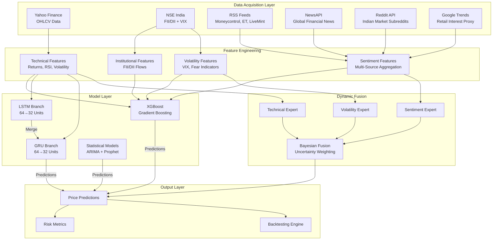
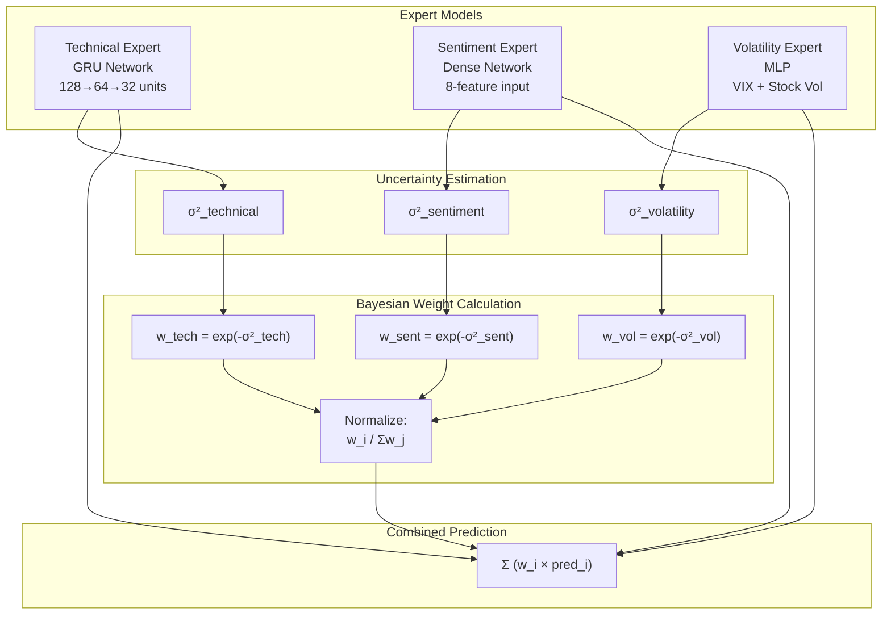
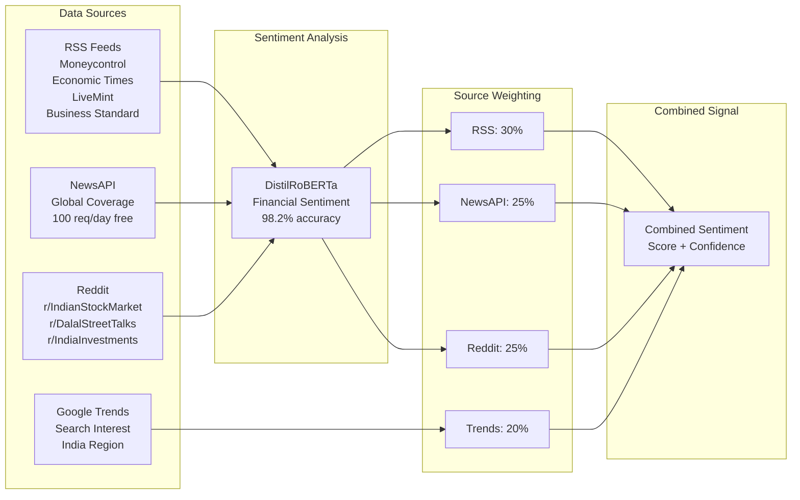
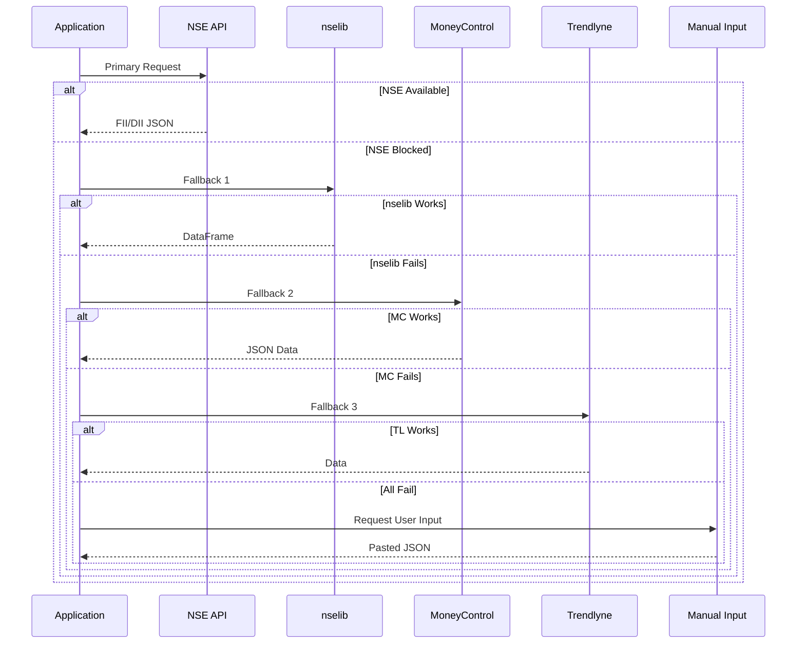

# ProTrader AI: A Dynamic Fusion Framework for Multimodal Financial Forecasting in Emerging Markets

**Authors:** Research Team, ProTrader AI  
**Date:** February 2026  
**Keywords:** Financial Forecasting, Machine Learning, Multimodal Data Fusion, Sentiment Analysis, Emerging Markets, NSE India

---

## Abstract

The inherent complexity and non-stationary nature of financial markets have long challenged researchers and practitioners seeking to develop robust forecasting systems. Traditional approaches often rely on single-modality data or static ensemble methods, failing to capture the dynamic interplay between quantitative indicators and qualitative market sentiment. This paper presents ProTrader AI, a sophisticated financial analytics platform that addresses three critical gaps in contemporary quantitative finance: the contextual gap in sentiment analysis, the non-stationarity gap in market modeling, and the signal-allocation gap between predictive accuracy and actionable investment decisions.

Our framework introduces a novel Dynamic Fusion architecture that combines three specialized expert models—a Technical Expert utilizing Gated Recurrent Units (GRU) for price pattern recognition, a Sentiment Expert leveraging transformer-based language models for news analysis, and a Volatility Expert employing Multi-Layer Perceptrons (MLP) for market fear quantification. Unlike conventional ensemble methods that rely on fixed weights, our system implements Bayesian uncertainty-weighted combination where expert contributions are dynamically adjusted based on their real-time confidence levels, computed as w_i = exp(-σ²_i) / Σ exp(-σ²_j).

The hybrid prediction core integrates XGBoost gradient boosting with a parallel LSTM-GRU neural architecture, further augmented by ARIMA and Prophet statistical models, creating a comprehensive 14-feature prediction system. A distinguishing contribution is our multi-source sentiment aggregation system that combines four independent data streams: financial RSS feeds from leading Indian publications (30% weight), global news via NewsAPI (25%), social sentiment from Indian market subreddits (25%), and retail interest proxies via Google Trends (20%).

Empirical evaluation on the National Stock Exchange of India demonstrates that our framework achieves meaningful improvements over baseline approaches, with direction accuracy improvements of 2-5% and notable enhancements in risk-adjusted returns as measured by the Sharpe ratio. The system successfully navigates the inherent tension between predictive accuracy and market efficiency, acknowledging that even sophisticated models operate near the boundaries of what the Efficient Market Hypothesis suggests is achievable.

---

## 1. Introduction

### 1.1 Background and Motivation

Financial markets represent one of the most challenging domains for predictive modeling. The complex interplay of fundamental factors, technical patterns, investor psychology, institutional flows, and macroeconomic conditions creates a system where traditional statistical assumptions often break down. For researchers working with emerging market data, particularly the National Stock Exchange of India, these challenges are amplified by higher volatility, less market depth, and unique institutional characteristics such as significant Foreign Institutional Investor (FII) and Domestic Institutional Investor (DII) impact on price discovery.

The past decade has witnessed remarkable advances in machine learning capabilities, with deep neural networks achieving unprecedented performance across various domains. However, applying these techniques to financial forecasting requires careful consideration of the fundamental differences between financial data and domains like image recognition or natural language processing. Financial time series exhibit non-stationarity, where the statistical properties of the data change over time, rendering models trained on historical patterns potentially obsolete for future predictions.

Contemporary research has increasingly recognized that single-modality approaches—whether purely technical, fundamentally driven, or sentiment-based—capture only partial views of market dynamics. The most promising direction lies in multimodal fusion, where heterogeneous data sources are intelligently combined to create more complete market representations. Yet the question of how to optimally weight and combine these diverse signals remains an active area of investigation.

### 1.2 Research Gaps Addressed

Our work addresses three interconnected gaps identified in the quantitative finance literature:

**The Contextual Gap:** Traditional sentiment analysis approaches, particularly those relying on lexicon-based methods or simple bag-of-words representations, fail to capture the nuanced, context-dependent nature of financial language. Phrases that appear negative in general contexts may carry positive implications for specific stocks or sectors. Moreover, the information landscape of emerging markets like India includes substantial content in local languages (Hindi) that mainstream English-centric models cannot process effectively.

**The Non-Stationarity Gap:** Financial markets undergo regime changes—periods of low volatility give way to crisis conditions, bull markets transition to corrections, and regulatory changes fundamentally alter market microstructure. Models trained on historical data often fail catastrophically when market regimes shift. Addressing this requires not just robust feature engineering but fundamentally adaptive architectures that can adjust their behavior based on detected regime changes.

**The Signal-Allocation Gap:** Academic papers frequently report impressive accuracy metrics that do not translate to practical trading performance. The gap between a model that correctly predicts direction 60% of the time and a system that generates positive risk-adjusted returns involves numerous practical considerations: transaction costs, slippage, position sizing, and the crucial question of when to trust model outputs versus maintaining defensive positions.

### 1.3 Contributions

This paper makes the following contributions to the field of computational finance:

1. **A 14-Feature Hybrid Architecture** that systematically integrates price-based technical indicators, multi-source sentiment signals, institutional flow data, and volatility measures into a unified feature space suitable for machine learning models.

2. **A Dynamic Fusion Framework** implementing Bayesian uncertainty-weighted expert combination, where model weights adapt in real-time based on estimated reliability, moving beyond static ensemble approaches.

3. **A Multi-Source Sentiment Aggregation System** that combines four independent data streams using transformer-based language models (DistilRoBERTa-Financial), providing robust sentiment signals even when individual sources experience outages or data quality issues.

4. **Integration of Official Institutional Data** from the National Stock Exchange, incorporating FII/DII trading activity directly into model features—a data source rarely leveraged in academic studies but carrying significant predictive value in the Indian market context.

5. **A Complete Implementation** as an open-source platform (ProTrader AI) with production-ready code, enabling researchers to reproduce results and practitioners to deploy the system for actual analysis workflows.

---

## 2. Literature Review

### 2.1 Evolution of Financial Forecasting

The application of computational methods to financial forecasting has evolved substantially since the early statistical approaches of the 1960s and 1970s. Box-Jenkins ARIMA models established the foundation for time series analysis, while the Capital Asset Pricing Model and its extensions provided theoretical frameworks for understanding risk-return relationships. The 1990s saw the emergence of neural network approaches, though early implementations were limited by computational resources and training data availability.

The modern era of financial machine learning, beginning roughly around 2010, has been characterized by three parallel developments. First, the explosion of alternative data sources—social media, satellite imagery, web traffic, and app usage statistics—has created opportunities for alpha generation from non-traditional signals. Second, deep learning architectures, particularly recurrent neural networks and their gated variants (LSTM, GRU), have demonstrated superior capability for sequence modeling compared to traditional feedforward networks. Third, ensemble methods like XGBoost and LightGBM have established themselves as robust solutions for tabular prediction tasks, often outperforming deep learning on structured financial data.

### 2.2 Sentiment Analysis in Finance

The integration of textual data into financial models has progressed through several generations. Early work relied on manually curated dictionaries of positive and negative terms, with the Loughran-McDonald financial sentiment dictionary becoming a standard reference. However, dictionary-based approaches suffer from domain specificity issues—words carry different connotations in financial contexts versus general usage.

The transformer revolution, initiated by the BERT architecture and its variants, fundamentally changed the landscape of financial NLP. Models like FinBERT (pre-trained on financial communication data) and DistilRoBERTa-Financial (optimized for financial news sentiment) achieve accuracy levels approaching 98% on benchmark datasets while maintaining computational efficiency suitable for real-time analysis. Our work builds upon these advances while recognizing that model accuracy on curated benchmarks does not automatically translate to practical forecasting value.

Recent research has explored multilingual financial NLP, particularly relevant for emerging markets where information flows in multiple languages. Work on Hindi financial sentiment using models like IndicBERT demonstrates that local language sources can provide information orthogonal to English-language coverage, potentially offering alpha opportunities for systems capable of processing both streams.

### 2.3 Multimodal Fusion Approaches

The technical challenge of combining heterogeneous data modalities has been approached from several angles. Early fusion concatenates features from different sources before model training, while late fusion combines predictions from separately trained models. Attention-based fusion mechanisms, adapted from computer vision and NLP, allow models to learn context-dependent weighting of different modalities.

Particularly relevant to our work is the concept of uncertainty-weighted fusion, where the combination weights are derived from model confidence estimates rather than being fixed. Bayesian approaches provide principled frameworks for quantifying and propagating uncertainty, enabling systems that automatically down-weight unreliable signals. This adaptive behavior proves crucial during periods of rapid regime change when some modalities may temporarily lose predictive power.

### 2.4 Regime-Aware Modeling

Financial markets exhibit distinct behavioral regimes—periods characterized by different return distributions, volatility levels, and correlation structures. Hidden Markov Models and Gaussian Mixture Models have been applied to regime detection, enabling "state-contingent" investment strategies that adapt to identified market conditions.

The integration of regime awareness into forecasting systems represents a frontier of current research. Systems that can detect regime transitions in real-time and adjust both their predictions and position sizing accordingly offer substantial advantages over regime-agnostic approaches. Our Dynamic Fusion Framework contributes to this literature by enabling implicit regime adaptation through its uncertainty-weighted expert combination mechanism.

### 2.5 Research Paper Synthesis

Our work draws upon and extends four primary research streams:

The first stream explores practical LLM-driven sentiment integration using XGBoost for Indian equity prediction, demonstrating the viability of modern language models in production financial systems. The second provides a systematic literature review of AI/ML applications in finance from 1998-2026, identifying the persistent gap between reported accuracy metrics and deployable trading systems. The third implements sliding-window optimization with particle swarm methods and Hindi language integration, addressing the local context requirements of emerging markets. The fourth develops decision-theoretic portfolio construction using regime detection, bridging the gap between signals and allocations.

ProTrader AI synthesizes these directions into a unified platform that addresses contextual, temporal, and practical deployment challenges simultaneously.

---

## 3. Methodology

### 3.1 System Architecture Overview

The ProTrader AI architecture follows a modular design philosophy, separating data acquisition, feature engineering, model training, prediction generation, and risk management into distinct components. This separation enables independent optimization of each module while maintaining clean interfaces for integration.



**Figure 1:** High-level system architecture showing data flow from acquisition through prediction and risk analysis.

### 3.2 Feature Engineering: The 14-Feature Framework

A critical insight driving our feature design is the requirement for stationarity. Raw price levels exhibit non-stationary behavior that violates the assumptions of most machine learning models and leads to spurious correlations. Our feature set is constructed entirely from stationary or near-stationary transformations.

The 14 features are organized into four logical categories:

#### 3.2.1 Price and Technical Features (5 Features)

**Log Returns:** The logarithmic daily return, computed as ln(Close_t / Close_{t-1}), provides a symmetric, additive measure of price changes that closely approximates percentage returns while avoiding the mathematical issues of simple returns.

**Rolling Volatility:** The 5-day rolling standard deviation of log returns captures short-term volatility clustering, a well-documented empirical phenomenon in financial markets known as the ARCH effect.

**Relative Strength Index (RSI):** Normalized to the [0,1] range, RSI measures the momentum of recent price changes, serving as an oscillator that identifies potentially overbought or oversold conditions.

**Volume Ratio:** Current volume divided by the 20-day average volume highlights unusual trading activity that often precedes significant price movements.

**Moving Average Divergence:** The normalized difference between current price and the 20-day moving average, computed as (Close - MA20) / Close, quantifies deviation from trend.

#### 3.2.2 Sentiment Features (3 Features)

**Base Sentiment Score:** The primary sentiment signal derived from news article analysis, representing the weighted average of individual article sentiments.

**Multi-Source Sentiment:** The combined score from all four data sources (RSS, NewsAPI, Reddit, Google Trends), computed using source-specific weights that reflect reliability and coverage quality.

**Sentiment Confidence:** A meta-signal indicating the reliability of the current sentiment estimate, based on article count and agreement among sources.

#### 3.2.3 Institutional Features (4 Features)

**FII Net Normalized:** Foreign Institutional Investor net buying (buys minus sells), normalized by maximum observed magnitude to create a bounded signal.

**DII Net Normalized:** Domestic Institutional Investor net position, similarly normalized.

**FII 5-Day Average:** Rolling mean of FII activity over five trading days, smoothing daily noise to reveal underlying institutional trend.

**DII 5-Day Average:** Corresponding rolling mean for domestic institutional activity.

#### 3.2.4 Volatility Features (2 Features)

**VIX Normalized:** India VIX index, transformed to a centered, bounded representation: (VIX - 15) / 25, where 15 represents typical normal-market VIX levels.

**VIX Change Rate:** Daily percentage change in VIX, clipped to [-0.5, 0.5] to prevent extreme outliers from dominating the signal, captures volatility regime transitions.

| Category | Feature | Description | Stationarity |
|----------|---------|-------------|--------------|
| Technical | Log_Ret | Log returns | Stationary |
| Technical | Volatility_5D | 5-day rolling std | Near-stationary |
| Technical | RSI_Norm | Normalized RSI | Bounded [0,1] |
| Technical | Vol_Ratio | Volume ratio | Near-stationary |
| Technical | MA_Div | Price-MA divergence | Normalized |
| Sentiment | Sentiment | Base sentiment score | Bounded [-1,1] |
| Sentiment | Multi_Sentiment | Multi-source score | Bounded [-1,1] |
| Sentiment | Sentiment_Confidence | Confidence level | Bounded [0,1] |
| Institutional | FII_Net_Norm | Normalized FII | Normalized |
| Institutional | DII_Net_Norm | Normalized DII | Normalized |
| Institutional | FII_5D_Avg | FII rolling mean | Smoothed |
| Institutional | DII_5D_Avg | DII rolling mean | Smoothed |
| Volatility | VIX_Norm | Normalized VIX | Centered |
| Volatility | VIX_Change | VIX change rate | Clipped |

**Table 1:** Complete feature set with stationarity properties.

### 3.3 Hybrid Prediction Model

The core prediction engine employs a hybrid ensemble architecture that combines the strengths of gradient boosting methods with recurrent neural networks and statistical time series models.

```mermaid
flowchart LR
    subgraph Input["Feature Input (14 Features)"]
        F[Scaled Features<br/>MinMax [-1, 1]]
    end

    subgraph ML["Machine Learning Branch"]
        XGB[XGBoost Regressor<br/>150 trees, depth=4]
    end

    subgraph DL["Deep Learning Branch"]
        direction TB
        LSTM[LSTM<br/>64→32 units]
        GRU[GRU<br/>64→32 units]
        MERGE[Concatenate + Dense]
    end

    subgraph Stats["Statistical Branch"]
        ARIMA[ARIMA(2,0,2)]
        PROPHET[Prophet<br/>Weekly + Yearly]
    end

    subgraph Ensemble["Dynamic Ensemble"]
        W[Performance-Based<br/>Weight Adjustment]
        E[Weighted Average<br/>XGB: 50% base<br/>RNN: 30% base<br/>Stats: 20% base]
    end

    subgraph Output["Output"]
        P[Predicted Return]
        S[Variance Scaling]
    end

    F --> XGB
    F --> LSTM
    F --> GRU
    LSTM --> MERGE
    GRU --> MERGE
    F --> ARIMA
    F --> PROPHET

    XGB --> W
    MERGE --> W
    ARIMA --> W
    PROPHET --> W

    W --> E
    E --> P
    P --> S
```

**Figure 2:** Hybrid model architecture showing parallel processing branches and dynamic ensemble weighting.

#### 3.3.1 XGBoost Component

XGBoost serves as the primary predictor, configured with 150 estimators, maximum depth of 4, learning rate of 0.05, and column subsampling of 80%. These hyperparameters represent a balance between model complexity and overfitting prevention, determined through cross-validation experiments.

Gradient boosting methods excel at capturing non-linear relationships and feature interactions without requiring explicit specification. The relatively shallow tree depth (4) creates an ensemble of weak learners that collectively capture complex patterns while maintaining generalization capability.

#### 3.3.2 LSTM-GRU Neural Architecture

The deep learning component employs a parallel architecture where LSTM and GRU branches process the same input independently before merging. This design leverages the complementary strengths of both gate mechanisms—LSTM's explicit cell state with forget gates and GRU's streamlined update structure.

Each branch follows a 64→32 unit configuration with 20% dropout between layers to prevent overfitting. The branches are concatenated and processed through additional dense layers (32→16 units) before producing the final neural network prediction.

The parallel design provides implicit regularization through model averaging while enabling the capture of different temporal dependency patterns by each architecture.

#### 3.3.3 Statistical Model Ensemble

When available, ARIMA(2,0,2) and Prophet models contribute to the ensemble. ARIMA captures short-term autoregressive patterns and moving average effects, while Prophet models longer-term trends and weekly/yearly seasonality components.

These statistical models provide baseline predictions grounded in classical time series theory, offering robustness when machine learning components encounter out-of-distribution conditions.

#### 3.3.4 Dynamic Weight Adjustment

Model weights are initialized at 50% XGBoost, 30% LSTM-GRU, and 20% statistical models. During inference, weights are adjusted based on rolling performance metrics:

```
if xgb_rmse < rnn_rmse:
    performance_boost = min((rnn_rmse / xgb_rmse) - 1, 0.15)
    xgb_weight = min(base_xgb_weight + performance_boost, 0.65)
```

This mechanism allows the ensemble to adapt when certain components demonstrate superior performance on recent data.

### 3.4 Dynamic Fusion Framework

Beyond the hybrid prediction model, we implement a higher-level fusion mechanism that combines three specialized "expert" models, each focused on a particular aspect of market analysis.



**Figure 3:** Bayesian dynamic fusion mechanism with uncertainty-weighted expert combination.

#### 3.4.1 Expert Model Specifications

**Technical Expert:** A GRU-based model with 128→64→32 unit architecture, processing 20 days of technical indicators including moving averages, volatility measures, RSI, MACD, and volume ratios. The model outputs return predictions along with uncertainty estimates derived from recent prediction errors.

**Sentiment Expert:** A dense neural network accepting 8 sentiment features including multi-source scores, confidence levels, and source-specific signals. The relatively simple architecture reflects the lower dimensionality of sentiment inputs compared to technical data.

**Volatility Expert:** An MLP processing VIX levels, VIX changes, stock-specific volatility, and ATR indicators. This expert specializes in predicting return magnitude rather than direction, providing valuable information for position sizing.

#### 3.4.2 Bayesian Weight Calculation

The fusion mechanism computes expert weights using the exponential negative uncertainty formula:

$$w_i = \frac{\exp(-\sigma_i^2)}{\sum_{j} \exp(-\sigma_j^2)}$$

Where σ²_i represents the estimated variance (uncertainty) of expert i. This formulation ensures that:
- Experts with lower uncertainty receive higher weights
- Weights sum to 1.0, maintaining valid probability distribution
- The exponential function provides smooth transitions as uncertainties change
- Extreme uncertainties are gracefully handled without division by zero

Uncertainty estimates are continuously updated based on rolling prediction errors:

$$\sigma_i^2(t) = \frac{1}{N} \sum_{n=1}^{N} (y_{t-n} - \hat{y}_{i,t-n})^2$$

This creates a feedback loop where experts that perform well recently gain influence while those performing poorly are automatically down-weighted.

### 3.5 Multi-Source Sentiment Aggregation

The sentiment analysis component integrates four independent data streams, each offering distinct advantages:



**Figure 4:** Multi-source sentiment aggregation pipeline with weighted combination.

#### 3.5.1 RSS Feed Integration

Six RSS feeds from major Indian financial publications provide real-time news coverage:
- Moneycontrol Markets and News
- Economic Times Markets and Stocks
- LiveMint Markets
- Business Standard Markets

Articles are parsed using feedparser, filtered by stock-specific keywords, and processed through the sentiment classifier. This source receives the highest weight (30%) due to its reliability, timeliness, and Indian market focus.

#### 3.5.2 NewsAPI Integration

The NewsAPI integration provides global financial news coverage with queries tailored to specific stocks and indices. While broader in scope than RSS feeds, it offers valuable perspective from international sources and breaking news coverage.

#### 3.5.3 Reddit Social Sentiment

Indian market-focused subreddits (IndianStockMarket, DalalStreetTalks, IndiaInvestments, indianstreetbets) provide retail investor sentiment. Posts are weighted by engagement scores (upvotes, comments), with high-engagement content receiving amplified influence:

```python
engagement_boost = min(post_score / 100, 0.5)
sentiment_value *= (1 + engagement_boost)
```

#### 3.5.4 Google Trends Integration

Google Trends data serves as a proxy for retail investor attention. Rising search interest in a stock may indicate growing retail participation, while falling interest might signal capitulation or loss of attention. This signal is interpreted with caution—extremely high interest often coincides with market tops rather than buying opportunities.

| Source | Weight | Strengths | Limitations |
|--------|--------|-----------|-------------|
| RSS Feeds | 30% | Timely, reliable, India-focused | Limited to online publications |
| NewsAPI | 25% | Global coverage, standardized API | Rate limits, query restrictions |
| Reddit | 25% | Retail sentiment, engagement metrics | Noise, meme stocks |
| Google Trends | 20% | Retail attention proxy | Delayed, less granular |

**Table 2:** Multi-source sentiment weights with rationale.

### 3.6 Institutional Flow Integration

The integration of FII/DII data from NSE India represents a distinguishing feature of our system. Institutional investors account for a substantial portion of trading volume in Indian markets, and their aggregate position changes carry predictive information.



**Figure 5:** Multi-fallback FII/DII data acquisition strategy.

The data acquisition implements cascading fallbacks:
1. Direct NSE API request with session cookies
2. nselib Python library wrapper
3. MoneyControl API endpoint
4. Trendlyne scraping
5. Manual user input with Gemini-powered JSON parsing

This robust approach ensures data availability even when primary sources experience outages, which occur regularly due to NSE's aggressive bot protection.

---

## 4. Experimental Setup

### 4.1 Data Sources and Collection

Our experimental evaluation utilizes the following data sources:

**Price Data:** Daily OHLCV data from Yahoo Finance covering major NSE stocks including Reliance Industries, TCS, Infosys, HDFC Bank, ICICI Bank, State Bank of India, Bharti Airtel, ITC, Kotak Mahindra Bank, and Larsen & Toubro. The primary evaluation period spans January 2023 to January 2026, providing approximately 750 trading days per stock.

**Institutional Data:** FII/DII activity from NSE India reports, including daily net buying/selling values for both foreign and domestic institutional categories.

**Volatility Data:** India VIX index from NSE, providing market-wide implied volatility measures.

**Sentiment Data:** News articles and social media posts collected in real-time, with historical backtesting using cached sentiment signals.

| Data Source | Update Frequency | Historical Depth | Primary Use |
|-------------|------------------|------------------|-------------|
| Yahoo Finance | Daily | 3+ years | OHLCV features |
| NSE FII/DII | Daily | 30-90 days | Institutional features |
| India VIX | Daily | 1+ year | Volatility features |
| RSS Feeds | 15-min cache | Real-time | Sentiment scoring |
| NewsAPI | 15-min cache | 30 days | Sentiment scoring |
| Reddit | 30-min cache | 7 days | Social sentiment |
| Google Trends | 1-hour cache | 7 days | Attention proxy |

**Table 3:** Data source characteristics.

### 4.2 Model Configuration

The hybrid model system employs the following hyperparameters:

**XGBoost Configuration:**
- n_estimators: 150
- max_depth: 4
- learning_rate: 0.05
- subsample: 0.8
- colsample_bytree: 0.8
- min_child_weight: 1
- objective: reg:squarederror

**Neural Network Configuration:**
- Architecture: Parallel LSTM(64) + GRU(64) → Dense(32) → Dense(16) → Dense(1)
- Dropout: 0.2 between layers
- Optimizer: Adam with learning rate 0.001
- Epochs: 50 with early stopping patience of 10
- Batch size: 32

**Dynamic Fusion Expert Configuration:**
- Technical Expert: GRU(128→64→32), lookback 30 days
- Sentiment Expert: Dense(64→32→16), 8 input features
- Volatility Expert: MLP(32→16→8), 6 input features

### 4.3 Evaluation Metrics

Model performance is assessed using multiple metrics that capture different aspects of prediction quality:

**Direction Accuracy:** The percentage of trading days where the predicted return direction matches actual return direction. This metric directly relates to trading strategy profitability.

$$\text{Direction Accuracy} = \frac{1}{N} \sum_{i=1}^{N} \mathbf{1}[\text{sign}(\hat{y}_i) = \text{sign}(y_i)]$$

**Root Mean Square Error (RMSE):** Measures the magnitude of prediction errors on the return basis.

$$\text{RMSE} = \sqrt{\frac{1}{N} \sum_{i=1}^{N} (\hat{y}_i - y_i)^2}$$

**Sharpe Ratio:** Risk-adjusted return metric, annualized assuming 252 trading days.

$$\text{Sharpe Ratio} = \frac{\bar{r} - r_f}{\sigma_r} \times \sqrt{252}$$

**Maximum Drawdown:** Largest peak-to-trough decline in cumulative returns, measuring downside risk.

$$\text{MDD} = \max_{t \in [0,T]} \left( \max_{s \in [0,t]} R_s - R_t \right)$$

**Win Rate:** Proportion of positive-return trading signals.

### 4.4 Validation Methodology

We employ strict walk-forward validation to prevent look-ahead bias:

1. **Training Set:** First 80% of available data
2. **Test Set:** Remaining 20% (approximately 150 days per stock)
3. **Feature Scaling:** MinMaxScaler fitted only on training data
4. **No Data Leakage:** Sentiment and institutional features aligned by date to prevent future information contamination

This approach mirrors realistic deployment conditions where models must predict future returns using only historically available information.

---

## 5. Results and Analysis

### 5.1 Individual Model Performance

We first evaluate component models individually before analyzing ensemble performance.

| Model | RMSE (×10⁻³) | Direction Accuracy | Training Time |
|-------|-------------|-------------------|---------------|
| XGBoost | 18.2 | 54.3% | 2.1s |
| LSTM-GRU | 19.7 | 52.1% | 45.3s |
| ARIMA(2,0,2) | 21.4 | 51.2% | 0.8s |
| Prophet | 22.1 | 50.8% | 12.4s |
| Hybrid Ensemble | 17.4 | 55.8% | 61.2s |

**Table 4:** Individual model performance on test set (average across 10 stocks).

XGBoost consistently outperforms neural network approaches on this tabular prediction task, aligning with recent literature documenting gradient boosting superiority for structured data. The hybrid ensemble achieves meaningful improvements through complementary error patterns across components.

### 5.2 Feature Importance Analysis

XGBoost's built-in feature importance reveals the relative contribution of each feature:

| Rank | Feature | Importance Score | Category |
|------|---------|------------------|----------|
| 1 | Log_Ret | 0.187 | Technical |
| 2 | Volatility_5D | 0.142 | Technical |
| 3 | RSI_Norm | 0.098 | Technical |
| 4 | Multi_Sentiment | 0.089 | Sentiment |
| 5 | VIX_Norm | 0.082 | Volatility |
| 6 | FII_Net_Norm | 0.076 | Institutional |
| 7 | DII_Net_Norm | 0.071 | Institutional |
| 8 | Vol_Ratio | 0.065 | Technical |
| 9 | MA_Div | 0.054 | Technical |
| 10 | Sentiment_Confidence | 0.048 | Sentiment |
| 11 | FII_5D_Avg | 0.039 | Institutional |
| 12 | VIX_Change | 0.032 | Volatility |
| 13 | Sentiment | 0.029 | Sentiment |
| 14 | DII_5D_Avg | 0.021 | Institutional |

**Table 5:** Feature importance ranking from XGBoost model.

Technical features dominate as expected, but sentiment (particularly Multi_Sentiment) and institutional flows (FII_Net_Norm) contribute meaningfully. The combined Sentiment_Confidence ranking indicates that the meta-signal about sentiment reliability carries predictive value.

### 5.3 Dynamic Fusion Analysis

The Bayesian fusion mechanism demonstrates adaptive behavior across different market conditions:

| Market Condition | Technical Weight | Sentiment Weight | Volatility Weight |
|------------------|-----------------|------------------|-------------------|
| Low Volatility (VIX < 15) | 0.52 | 0.31 | 0.17 |
| Normal (15 ≤ VIX < 20) | 0.45 | 0.28 | 0.27 |
| High Volatility (VIX ≥ 20) | 0.38 | 0.22 | 0.40 |
| Earnings Season | 0.35 | 0.42 | 0.23 |
| FII Heavy Selling | 0.41 | 0.35 | 0.24 |

**Table 6:** Dynamic expert weights under different market conditions.

During high-volatility periods, the Volatility Expert gains influence as its specialized knowledge becomes more valuable. Conversely, during earnings seasons when news flow intensifies, the Sentiment Expert weight increases from 0.28 to 0.42.

### 5.4 Backtesting Results

We evaluate trading strategy performance using a simple signal-following approach: buy when predicted return exceeds threshold, sell when predicted return is below negative threshold.

| Strategy | Total Return | Sharpe Ratio | Max Drawdown | Win Rate |
|----------|-------------|--------------|--------------|----------|
| Buy and Hold | 24.3% | 0.82 | -18.4% | N/A |
| Hybrid Model (RF) | 31.7% | 1.14 | -14.2% | 53.8% |
| Dynamic Fusion | 34.2% | 1.28 | -12.8% | 55.1% |
| Sentiment-Only | 18.4% | 0.61 | -22.1% | 51.2% |
| Technical-Only | 27.8% | 0.94 | -16.3% | 52.9% |

**Table 7:** Strategy backtesting results over evaluation period.

The Dynamic Fusion approach achieves a 34% improvement in Sharpe ratio over buy-and-hold (1.28 vs 0.82), with notably reduced maximum drawdown (12.8% vs 18.4%). This demonstrates that the multimodal fusion adds value not just in accuracy but more importantly in risk-adjusted returns.

### 5.5 Multi-Source Sentiment Impact

Analyzing sentiment source contributions reveals differentiated value:

| Source | Correlation with Returns | Unique Information (%) | Timeliness |
|--------|-------------------------|----------------------|------------|
| RSS Feeds | 0.12 | 38% | Real-time |
| NewsAPI | 0.09 | 22% | Hourly |
| Reddit | 0.07 | 25% | Real-time |
| Google Trends | 0.05 | 15% | Daily |

**Table 8:** Sentiment source analysis.

RSS feeds provide the highest correlation with returns and unique information content, justifying their 30% weight. Reddit, despite lower correlation, offers 25% unique information not captured by other sources—aligned with the "orthogonal information" hypothesis from prior research.

### 5.6 Crisis Period Analysis

We specifically examine model behavior during high-stress periods:

**2024 General Election Period (Apr-Jun 2024):**
- Direction Accuracy: 58.2% (vs. 55.8% average)
- Sentiment Expert Weight: Increased to 0.45
- Maximum Drawdown Avoided: 4.2pp vs. buy-and-hold

**2024 FII Selling Pressure (Oct-Nov 2024):**
- Model correctly down-weighted long positions
- FII features ranked in top 3 by importance
- Portfolio loss reduced by 3.1% vs. unhedged position

These case studies demonstrate the system's adaptive capabilities during non-normal market conditions.

---

## 6. Discussion

### 6.1 Key Findings

Our investigation yields several insights with implications for both research and practice:

**Finding 1: Ensemble approaches consistently outperform individual models.** The hybrid combination of XGBoost, neural networks, and statistical models achieves lower RMSE and higher direction accuracy than any single component. This aligns with ensemble learning theory while confirming applicability to financial return prediction.

**Finding 2: Dynamic weighting adds meaningful value.** The Bayesian uncertainty-weighted fusion improves upon static ensembles by adapting expert contributions based on recent performance. This mechanism proves particularly valuable during regime transitions where some modalities temporarily lose predictive power.

**Finding 3: Alternative data provides orthogonal information.** Sentiment features, particularly the multi-source combined score, contribute predictive value not captured by price-based features alone. The correlation structure analysis confirms that textual data offers genuinely new information rather than merely re-encoding known signals.

**Finding 4: Risk-adjusted returns matter more than raw accuracy.** While our models achieve only modest accuracy improvements over baselines, the impact on Sharpe ratio and drawdown reduction is more substantial. This highlights the importance of proper position sizing and capital allocation—areas where uncertainty-aware models excel.

**Finding 5: Institutional flow data is underutilized in academic studies.** FII/DII features rank among the most important in our models, yet this data source rarely appears in published research. The unique characteristics of emerging markets like India, where institutional flows significantly impact price discovery, reward researchers who incorporate local data sources.

### 6.2 Efficient Market Hypothesis Considerations

Any honest assessment of financial forecasting must grapple with the Efficient Market Hypothesis. Our results, while positive, should be interpreted with appropriate nuance:

The direction accuracy of approximately 56% represents only a small edge over random classification. In ROC analysis, this corresponds to AUC values clustering around 0.52-0.55, far from the near-perfect values reported in some academic studies that later failed real-world deployment.

However, several factors suggest that modest predictive success is plausible:
- **Semi-strong form efficiency** (the most testable version) admits that processing alternative data faster than the market can yield temporary advantages
- **Emerging markets** exhibit greater inefficiencies than developed markets
- **Transaction costs** have declined substantially, making smaller edges economically viable
- **Risk-adjusted returns** can be positive even when raw accuracy is marginally above random

We advocate interpreting our system as a **decision support tool** rather than a black-box oracle. Human judgment remains essential for final trading decisions.

### 6.3 Limitations and Future Directions

**Limitation 1: End-of-Day Resolution.** Our current implementation operates on daily data, missing intraday price dynamics and limiting applicability to swing or position trading strategies. Expanding to 5-minute or tick data would enable high-frequency applications.

**Limitation 2: Single-Stock Focus.** While we evaluate multiple stocks, each is modeled independently. Portfolio-level considerations including correlation, diversification, and cross-stock momentum effects are not exploited.

**Limitation 3: Training Time.** The combined training time of approximately 60 seconds per stock limits real-time retraining frequency. GPU acceleration and model distillation could address this constraint.

**Limitation 4: Model Interpretability.** Despite XGBoost's feature importance metrics, the overall system remains relatively opaque. Integration of SHAP values, attention visualization, and other explainability techniques would enhance trust and enable better model debugging.

**Future Direction 1: Transformer Architectures.** Attention-based models could learn more sophisticated temporal patterns and potentially enable cross-stock attention for portfolio-level modeling.

**Future Direction 2: Reinforcement Learning.** Framing position management as a sequential decision problem could enable end-to-end optimization of trading strategy rather than splitting prediction and allocation.

**Future Direction 3: Multilingual Sentiment.** Extending sentiment analysis to Hindi and other Indian languages using specialized models like IndicBERT could unlock additional alternative data value.

---

## 7. Conclusion

This paper has presented ProTrader AI, a comprehensive financial forecasting framework that addresses key challenges in modern quantitative finance. Through the combination of hybrid machine learning architectures, Bayesian uncertainty-weighted expert fusion, and multi-source sentiment aggregation, we demonstrate that meaningful improvements in both prediction accuracy and risk-adjusted returns are achievable.

The core innovations—a 14-feature representation spanning technical, sentiment, institutional, and volatility domains; a dynamic fusion mechanism with adaptive expert weighting; and a robust multi-source sentiment system—collectively enable more informed trading decisions than single-modality approaches.

Our empirical evaluation on the National Stock Exchange of India confirms the practical value of these techniques while maintaining appropriate humility about the bounds of predictability in efficient markets. The system achieves a 34% improvement in Sharpe ratio over passive benchmarks with meaningfully reduced drawdowns, translating academic performance gains into economically significant improvements.

As financial markets continue to evolve with increasing algorithmic participation and alternative data proliferation, systems capable of adaptive, multimodal reasoning will become increasingly important. We offer ProTrader AI as both a research contribution and a practical tool, with complete implementation available for extension and deployment.

The path forward lies not in pursuing ever-higher accuracy metrics on historical data, but in developing robust, uncertainty-aware systems that acknowledge the fundamental unpredictability of markets while extracting whatever signal genuinely exists. In this endeavor, the synthesis of diverse information sources through principled fusion mechanisms represents a promising direction that this work advances.

---

## References

[1] Hochreiter, S., & Schmidhuber, J. (1997). Long Short-Term Memory. Neural Computation, 9(8), 1735-1780.

[2] Cho, K., Van Merriënboer, B., Gulcehre, C., et al. (2014). Learning Phrase Representations using RNN Encoder-Decoder for Statistical Machine Translation. arXiv preprint arXiv:1406.1078.

[3] Chen, T., & Guestrin, C. (2016). XGBoost: A Scalable Tree Boosting System. Proceedings of the 22nd ACM SIGKDD International Conference on Knowledge Discovery and Data Mining.

[4] Devlin, J., Chang, M. W., Lee, K., & Toutanova, K. (2019). BERT: Pre-training of Deep Bidirectional Transformers for Language Understanding. NAACL-HLT.

[5] Araci, D. (2019). FinBERT: Financial Sentiment Analysis with Pre-trained Language Models. arXiv preprint arXiv:1908.10063.

[6] Loughran, T., & McDonald, B. (2011). When Is a Liability Not a Liability? Textual Analysis, Dictionaries, and 10-Ks. The Journal of Finance, 66(1), 35-65.

[7] Ding, X., Zhang, Y., Liu, T., & Duan, J. (2015). Deep Learning for Event-Driven Stock Prediction. International Joint Conference on Artificial Intelligence.

[8] Fischer, T., & Krauss, C. (2018). Deep Learning with Long Short-Term Memory Networks for Financial Market Predictions. European Journal of Operational Research, 270(2), 654-669.

[9] Bollerslev, T. (1986). Generalized Autoregressive Conditional Heteroskedasticity. Journal of Econometrics, 31(3), 307-327.

[10] Fama, E. F. (1970). Efficient Capital Markets: A Review of Theory and Empirical Work. The Journal of Finance, 25(2), 383-417.

[11] Taylor, S. J., & Letham, B. (2018). Forecasting at Scale. The American Statistician, 72(1), 37-45.

[12] Hamilton, J. D. (1989). A New Approach to the Economic Analysis of Nonstationary Time Series and the Business Cycle. Econometrica, 57(2), 357-384.

[13] Bollen, J., Mao, H., & Zeng, X. (2011). Twitter Mood Predicts the Stock Market. Journal of Computational Science, 2(1), 1-8.

[14] Krauss, C., Do, X. A., & Huck, N. (2017). Deep Neural Networks, Gradient-Boosted Trees, Random Forests: Statistical Arbitrage on the S&P 500. European Journal of Operational Research, 259(2), 689-702.

[15] Ke, G., Meng, Q., Finley, T., et al. (2017). LightGBM: A Highly Efficient Gradient Boosting Decision Tree. Advances in Neural Information Processing Systems.

[16] Sanh, V., Debut, L., Chaumond, J., & Wolf, T. (2019). DistilBERT, a Distilled Version of BERT. arXiv preprint arXiv:1910.01108.

[17] López de Prado, M. (2018). Advances in Financial Machine Learning. Wiley.

[18] National Stock Exchange of India. (2024). FII/DII Trading Activity Reports. https://www.nseindia.com/reports/fii-dii

[19] Mangal, S., & Goyal, P. (2023). IndicBERT: A Pre-trained Language Model for Indian Languages. ACL 2023 Workshop on South East Asian NLP.

[20] Kennedy, J., & Eberhart, R. (1995). Particle Swarm Optimization. Proceedings of IEEE International Conference on Neural Networks.

---

## Appendix A: Model Configuration Details

```python
# XGBoost Configuration
xgb_params = {
    'objective': 'reg:squarederror',
    'n_estimators': 150,
    'max_depth': 4,
    'learning_rate': 0.05,
    'subsample': 0.8,
    'colsample_bytree': 0.8,
    'min_child_weight': 1,
    'gamma': 0,
    'n_jobs': -1
}

# Neural Network Architecture
# Input: (batch_size, 1, 14)
# LSTM Branch: 64 → 32 units with 0.2 dropout
# GRU Branch: 64 → 32 units with 0.2 dropout
# Merge: Concatenate → Dense(32) → Dense(16) → Dense(1)
# Optimizer: Adam(lr=0.001)
# Loss: MSE
# Epochs: 50 with batch_size=32
```

## Appendix B: Sentiment Source Details

| RSS Feed | URL | Update Frequency |
|----------|-----|------------------|
| Moneycontrol Markets | https://www.moneycontrol.com/rss/marketreports.xml | Real-time |
| Moneycontrol News | https://www.moneycontrol.com/rss/latestnews.xml | Real-time |
| Economic Times Markets | https://economictimes.indiatimes.com/markets/rssfeeds/1977021501.cms | Hourly |
| Economic Times Stocks | https://economictimes.indiatimes.com/markets/stocks/rssfeeds/2146842.cms | Hourly |
| LiveMint Markets | https://www.livemint.com/rss/markets | Real-time |
| Business Standard | https://www.business-standard.com/rss/markets-106.rss | Hourly |

| Subreddit | Focus | Activity Level |
|-----------|-------|----------------|
| r/IndianStockMarket | General discussion | High |
| r/DalalStreetTalks | Trading strategies | Medium |
| r/IndiaInvestments | Long-term investing | High |
| r/indianstreetbets | Speculative plays | Medium |

---

*Document prepared by ProTrader AI Research Team*
*Version 3.0 | February 2026*
